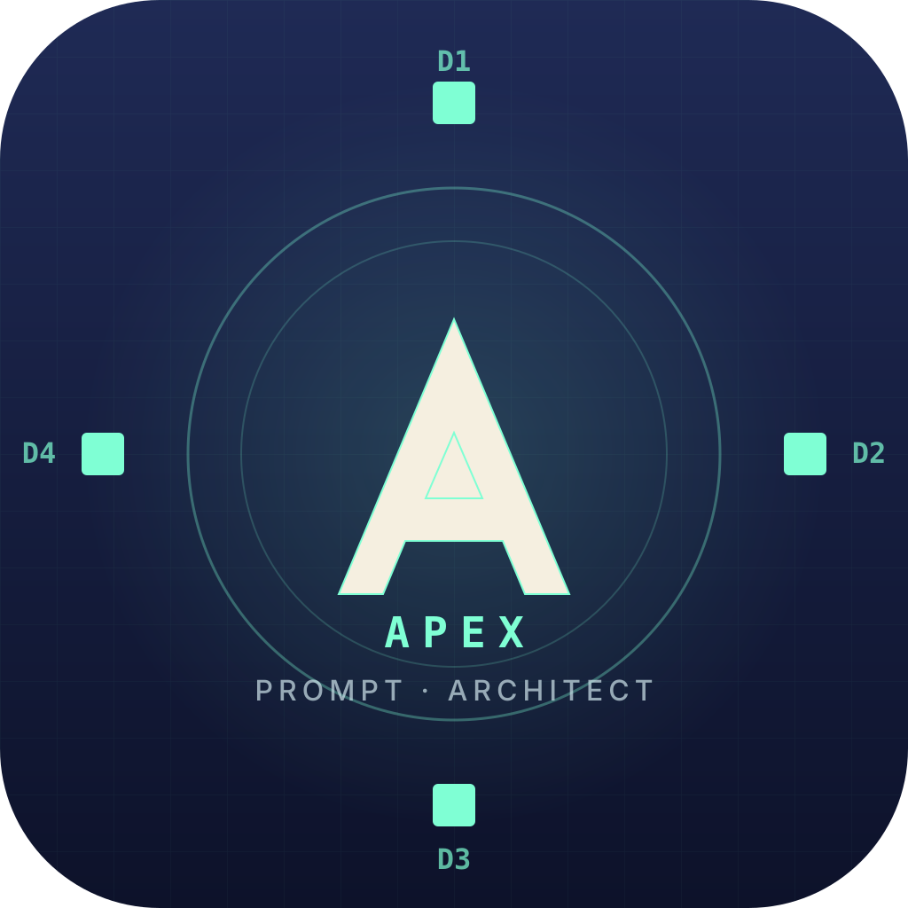
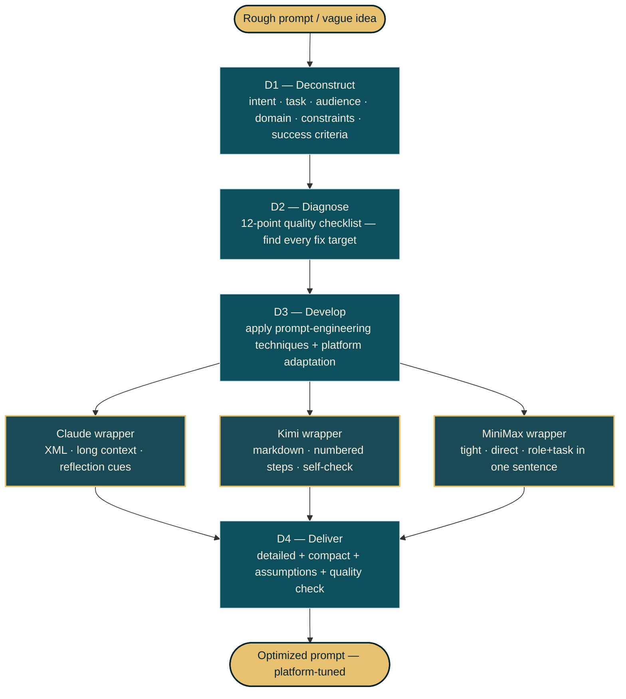

<p align="center">
  
</p>

# APEX Prompt Architect

> 🇸🇦 [اقرأ بِالعَرَبية](README.ar.md) — Arabic README in native MSA phrasing.

Turn rough prompts into production-grade prompts — optimized for **Claude**, **Kimi**, or **MiniMax**.

Built as an [Agent Skills](https://agentskills.io) skill. The skill applies the **APEX 4D method** (Deconstruct → Diagnose → Develop → Deliver), runs a 12-point quality checklist, and emits both a detailed and a compact version of the result.

The full specification, transformation protocol, and platform-adaptation rules all live in **[`SKILL.md`](SKILL.md)**. This README is a one-screen overview.

## What it does

Take any of these inputs:
- A rough one-line idea ("i need a prompt that does X")
- An incomplete first-draft prompt
- A prompt that works in one model but fails in another
- A spec for an agent persona (role, goals, responsibilities)

…and produce a polished prompt that is **platform-aware** — same intent, three different shapes depending on whether you target Claude (long context, XML structure, explicit reflection), Kimi (document-anchored, step decomposition), or MiniMax (tight, direct, fast).

## Workflow



## Quickstart

```bash
# Default target is Claude
python scripts/apex_workflow.py --input rough.md --output optimized.md

# Target Kimi instead
python scripts/apex_workflow.py --input rough.md --platform kimi --output optimized.md

# Compare across all three platforms
python scripts/apex_workflow.py --input rough.md --platform all --output-dir ./out/

# Validate an existing prompt against the 12-point checklist
python scripts/validate_prompt.py --input existing.md
```

The skill is **provider-agnostic** for the analysis stage. The 4D pipeline runs deterministically without an API key. If you want the LLM-driven D3 enrichment, configure any OpenAI-compatible endpoint:

```bash
export LLM_API_URL=https://api.openai.com/v1/chat/completions
export LLM_API_KEY=sk-...
export LLM_MODEL=gpt-4o-mini
```

## Installation

| Your environment | How to install |
|---|---|
| **Claude Code / Codex CLI / MiniMax CLI / any agent CLI that imports `.skill`** | Download the `.skill` bundle from [Releases](../../releases). |
| **Kimi CLI** | Use **[`INSTALL-FOR-KIMI.md`](INSTALL-FOR-KIMI.md)** — self-contained markdown installer. |
| **MiniMax CLI specifics** | See **[`INSTALL-FOR-MINIMAX.md`](INSTALL-FOR-MINIMAX.md)** for env-var conventions. |
| **Manual / forking** | `git clone` this repo. The repo content IS the skill. |

## Platforms supported

| Platform | Status | What we optimize for |
|---|---|---|
| **Claude** | ✅ Primary target | Long context · reflective reasoning · XML structure · safety-aware |
| **Kimi** | ✅ Supported | Long-document synthesis · clear task decomposition · markdown hierarchy |
| **MiniMax** | ✅ Supported | Fast execution · tight prompts · role+task in opening sentence |

## What's in the box

| Path | What |
|---|---|
| `SKILL.md` | Canonical skill spec — frontmatter + body ≤500 lines |
| `scripts/apex_workflow.py` | CLI driver — runs the 4D method end-to-end |
| `scripts/validate_prompt.py` | 12-point quality-checklist linter |
| `scripts/compare_platforms.py` | Side-by-side renderer (Claude / Kimi / MiniMax) |
| `templates/for-<platform>.md` | Per-platform wrapper skeletons |
| `prompts/` | 10 reusable ready-made prompts (onamfc-style with frontmatter) |
| `references/*.md` | 9 deep-dive references — APEX 4D, anatomy, patterns, anti-patterns, safety, Arabic |
| `examples/` | 5 byte-deterministic before/after pairs |
| `evals/run_golden.py` | Regression tests for the optimization pipeline |
| `config.example.json` | Provider configuration reference |

## Design notes

- **APEX 4D method** — Deconstruct, Diagnose, Develop, Deliver. Adapted from prompt-engineering literature (DAIR-AI guide, Anthropic docs, OpenAI cookbook) into a deterministic workflow.
- **Platform-aware, not platform-locked** — supports Claude, Kimi, MiniMax today. New platforms drop in via a new `templates/for-<platform>.md` + an entry in `references/03-platform-adaptation.md`.
- **Provider-agnostic for LLM calls** — uses `LLM_API_URL` / `LLM_API_KEY` / `LLM_MODEL` like the [arabic-ai-text-humanizer](https://github.com/drxvb/arabic-ai-text-humanizer) skill.

## License

[MIT](LICENSE). Copyright © 2026.

## Acknowledgments

Structural inspiration: `onamfc-agent-prompt-library` (per-agent template pattern), `convertscout-awesome-ai-prompts` (per-platform organization), `dair-ai/Prompt-Engineering-Guide` (methodology references), and the [arabic-ai-text-humanizer](https://github.com/drxvb/arabic-ai-text-humanizer) repo (Agent Skills layout, evals discipline, multi-platform release pattern).
